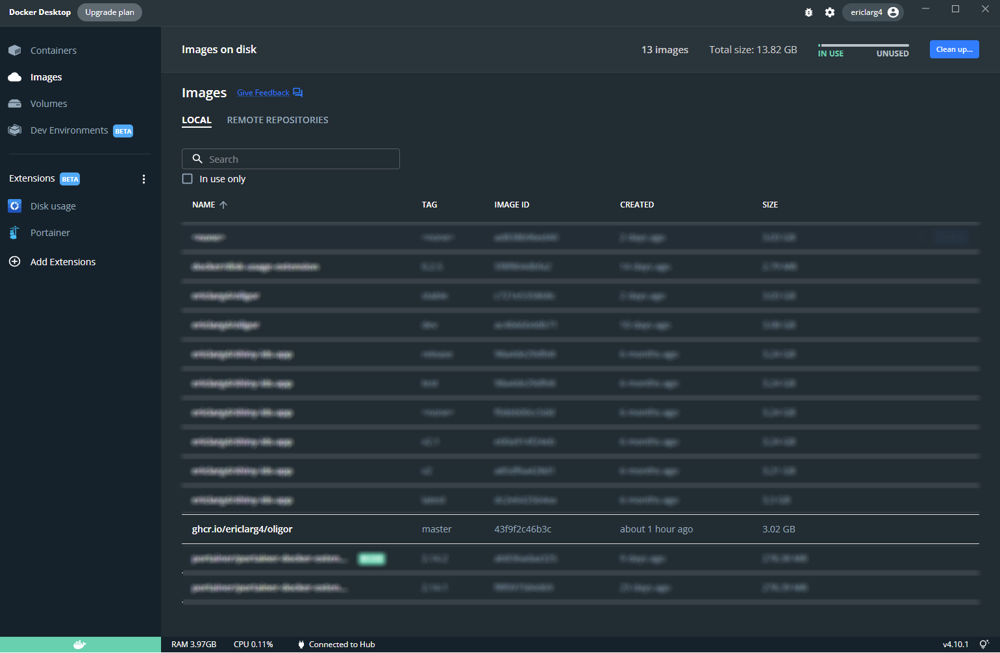
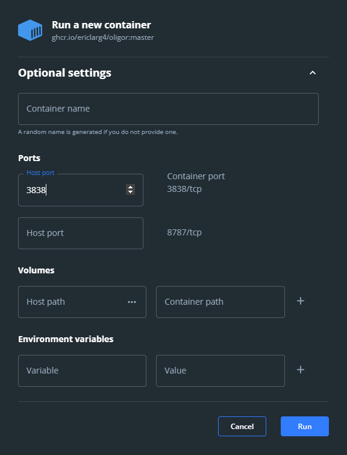
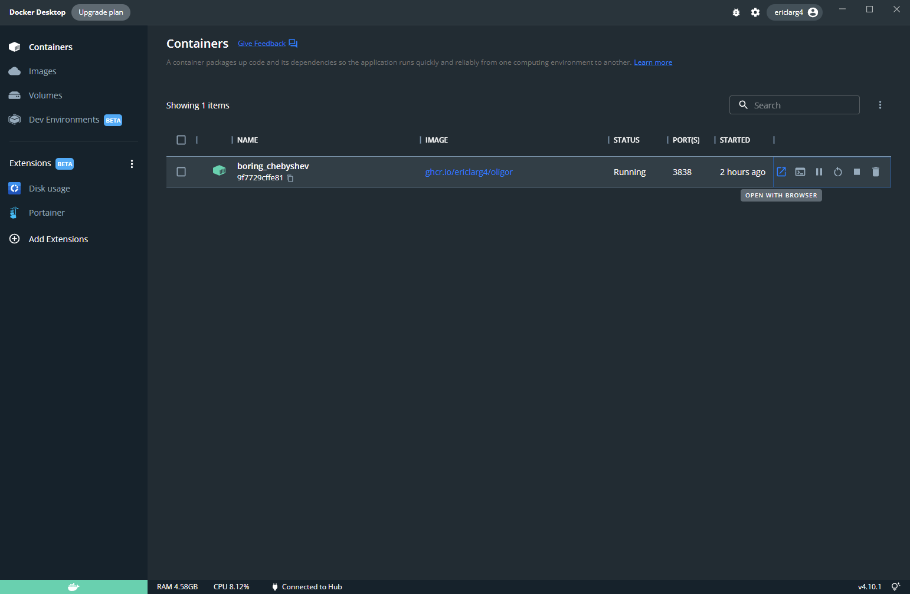

# What is OligoR?

OligoR is a native HDX/MS data processing application dedicated to oligonucleotides and their complexes. OligoR accepts open-format MS files, and can be used for data processing and the generation of publication-quality figures for HDX/MS, MS kinetics, and MS titrations experiments.

Although developed with oligonucleotides in mind, OligoR can be used for other types of analytes.

OligoR is an entirely open-source application, that can be run from the source code in R, or more simply from a Docker container.

# Online access

OligoR may be accessed online at [oligor.seis.me](oligor.seis.me). The server may not always be running. Feel free to contact me if that is the case.

# Installation and updating for local use

## From R source code

This method requires the installation of [R](https://cran.r-project.org/bin/windows/base/) (and a code editor such as [Rstudio](https://www.rstudio.com/products/rstudio/download/#download)).

Download or clone the source code to your local machine. All dependencies will be installed on the first use of the app, which will take some time.

Create a project at the root of the OligoR directory, or set the working directory to this location using the following command (where `PATH_TO_OLIGOR` with the actual path to OligoR on your machine):

    setwd(PATH_TO_OLIGOR/OligoR)

To update, either download the latest version of OligoR, or if you have cloned the repository simply pull the changes.

## From Docker

This method requires the installation of [Docker Desktop](https://docs.docker.com/get-docker/).

From a terminal, execute either of the following command to obtain the OligoR image.

From GitHub:

    docker pull ghcr.io/ericlarg4/oligor:master
    
From DockerHub:
    
    docker pull ericlarg4/oligor:master

To update, simply use the above command again, or click on pull in the Docker desktop software (click on the three dot menu on the image line, then click on pull). This image is automatically re-built when the source code is changed.

# How to launch OligoR?

## With the R source code

To open the app, either:

-   In Rstudio, open the server.R or ui.R files located in the app folder, then click on Run App at the top of the Source pane.
-   Use the command `shiny::runApp(appDir = 'app')`, assuming you work in a project and/or have set the working directory to OligoR as described above
-   Use the command `shiny::runApp(appDir = 'PATH_TO_OLIGOR/OligoR/app')` if you have not set the working directory or created a project for OligoR

## With Docker

To open the app with Docker, either:

-   Use Docker Desktop GUI:

    -   Open Docker Desktop

    -   In the *Images* panel, hover the cursor over *ghcr.io/ericlarg4/oligor*, then click on Run

        

    -   In the *Optional settings*, set the first *Host port* to 3838

        

    -   Click on Run

    -   In the Containers panel, which should now be opened, click on the *Open with browser* icon (immediatly to the right of the Started time, on the right-hand side of the line)

        

    -   After using OligoR, you may stop and remove the container (using the dedicated icons), or keep it running for further uses

-   Use a terminal:

    -   Open a terminal
    -   Type `docker run --rm -p 3838:3838 ghcr.io/ericlarg4/oligor:master`
    -   In a browser, connect to `http://localhost:3838/`
    -   To stop and remove the container, execute `docker ps -q --filter ancestor=ghcr.io/ericlarg4/oligor:master | xargs docker stop` in a terminal

# How to use OligoR?

Refer to the [Wiki of the repository](https://github.com/EricLarG4/OligoR/wiki).

Demo data files are available in the *demo data* directory of OligoR, including both raw and processed data.

# Who to ask in case of issue?

Create an issue of the [issues page](https://github.com/EricLarG4/OligoR/issues) or ask [this guy](mailto:e-deuteron@protonmail.com).
